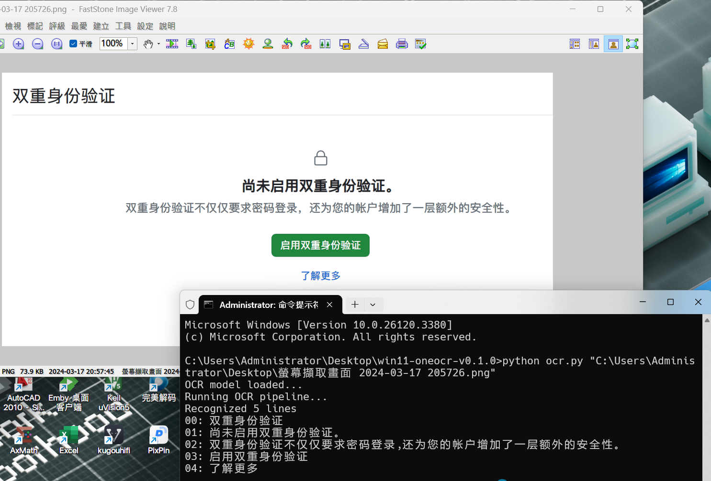

## Windows11 SnippingTool OCR

How to use:

The code depends on the DLLs and offline AI model, the easiest way is copy those files from SnippingTool folder, puts them in the same folder of ocr.py

includes: 

- oneocr.dll
- oneocr.onemodel
- onnxruntime.dll

On my computer the SnippingTool folder located at `C:\Program Files\WindowsApps\Microsoft.ScreenSketch_11.2501.7.0_x64__8wekyb3d8bbwe\SnippingTool`
Versions may different.

Thank Deepseek !

# Credits

https://github.com/b1tg/win11-oneocr
